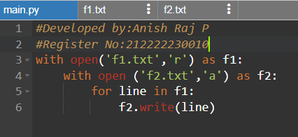

# copy-file
## AIM:
To write a python program for copying the contents from one file to another file.
## EQUIPEMENT'S REQUIRED: 
PC
Anaconda - Python 3.7
## ALGORITHM: 
### Step 1:
Open the file f1 in read mode.
### Step 2: 
Open the file f2 in append mode.
### Step 3: 
Copy the contents using write() with the for loop.
### Step 4:  
End the program.
## PROGRAM:
#Developed By: Anish Raj P 
#Register No: 212222230010 
with open('f1.txt','r') as f1: 
    with open ('f2.txt','a') as f2: 
        for line in f1: 
            f2.write(line) 
### OUTPUT:
#### FILE 1: 
 
#### FILE 2: 
 
## RESULT:
Thus the program is written to copy the contents from one file to another file.